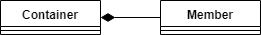
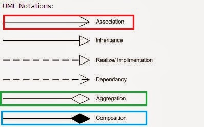
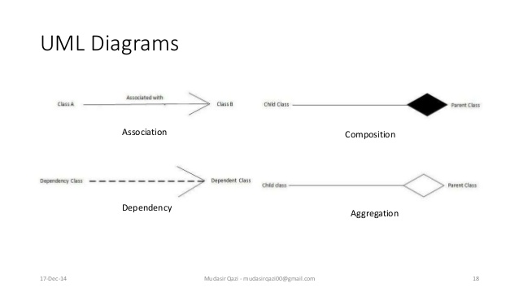
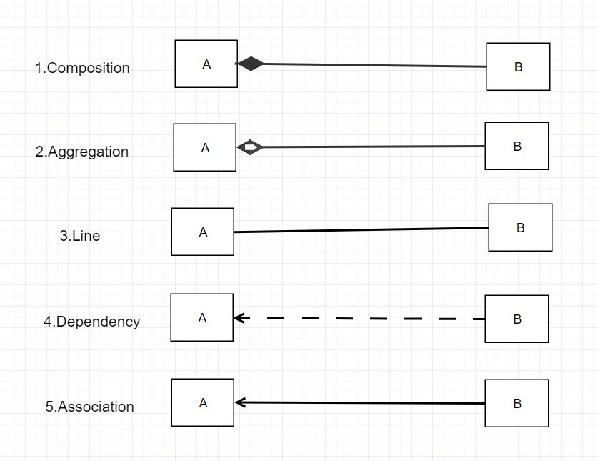
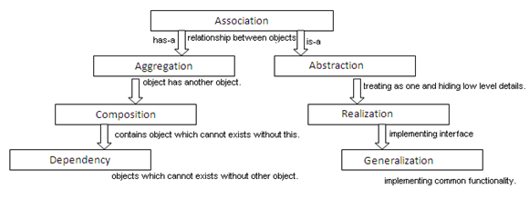
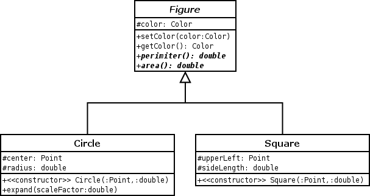
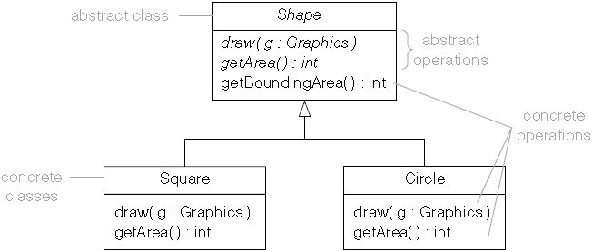

# Paradigmas de programación

Materia y código visto en clases. Referente a Java y al paradigma orientado a objetos (OOP)-
Todo el código de este repositorio se hizo funcionar con Java 11.

# OOP

# Clase 1: Análisis y diseño OOP

## Ejercicio 1  (resolución en clases)
Modele el siguiente ejercicio en Java, documentando sus atributos y métodos. Luego, realice una representación mediante diagrama de clases UML.

* Critico de películas
    * Cree la clase Reviewer que modela a un critico de películas que califica películas.
    * La calificación es medida en estrellas de 1 a 5.
    * Una película tiene nombre, año, director. 
    *  El Reviewer califica un conjunto de películas y además se debe obtener la calificación de cada una de ellas.

* Tip: Primero, piense lo siguiente, ¿cómo va a especificar la película y su calificación?


# Clase 2: Relaciones POO I

## Composición y agregación

Implemente la resolución de los siguientes ejercicios en Java.

### Ejercicio 1 (resolución en clases)
* En la Universidad Acme, los profesores dictan clases y los alumnos se inscriben (asocian) a cada ramo impartido por el profesor. 
* Luego, múltiples estudiantes pueden estar asociados a un solo profesor y un solo estudiante puede estar asociado a múltiples profesores (asociación).
* Asimismo, la universidad se encuentra en período de exámenes.
* Un examen contiene preguntas y respuestas.
* Una pregunta puede tener múltiples respuestas y una respuesta no puede pertenecer a múltiples preguntas. 
* Si borramos una pregunta, las respuestas deben borrarse automáticamente (composición).

### Ejercicio 2 (Ejercicio propuesto para realizar fuera del horario de clase)
* En la empresa HardWorks se tienen empleados y supervisor de área. Cada empleado debe reportar a su supervisor.
* Cada empleado solo tiene un supervisor a cargo. Si el supervisor deja la empresa, el empleado no se ve afectado. (agregación).


## Clase 3: Relaciones POO II 
### Ejercicio 1 Herencia (resolución en clases)
* Herencia

A. Una línea 2D tiene dos dimensiones, x e y. Haciendo uso de herencia, ¿cómo implementaría una línea 3D?

B. Una línea se compone de dos puntos. Punto inicio y punto final. Primero implemente mediante composición la representación de una línea basada en la definición previamente escrita.  Luego, diseñe e implemente otra clase que contenga la representación de una línea, pero ahora utilizando herencia. Es decir, una línea hereda el comportamiento de un punto.

Tip: cuando hacemos uso de composición, “una línea se compone de dos puntos”, pero cuando hacemos uso de herencia, “una línea es un punto extendido por otro punto”

### Ejercicio 2 Composición (resolución en clases)
* Polimorfismo

Implemente un programa que obtenga múltiples tipos de formas geométricas y su área, por ejemplo, el programa obtendrá figuras tales como, triángulo, rectángulo, etc. En primer lugar, debe implementar una superclase “Figura” que definirá el comportamiento de todas las figuras. Asuma que todas las figuras tienen un atributo en común, que en este caso será el color.

Tip:

Área rectángulo: largo*ancho

Área triángulo: 0,5*base*altura

# Java

Los objetos esta relacionados unos con otros, tanto en la vida real como en la programación.

## Composition and Aggregation (Composicion y Agregacion)

### Composicion

* La composición es una relación del tipo "pertenece a".
* La relación "pertenece a" implica que uno de los objetos es una estructura más grande que otra que además lo contiene.
* Composición indica que un objeto es parte de otro.
* Relación del tipo "tiene un" (has a).
* Los ciclos de vida del objeto se encuentran amarrados.
* Si destruimos el objeto que contiene a otro, también se destruye este último.
* Ejemplo:
  * Un edificio esta compuesto de habitaciones, si destruimos el edificio también destruimos las habitaciones

#### UML

* La composición se representa con un diamante en negro.
* Diamante en negro significa una relación fuerte.




#### Java 

* En Java la composición se da a través del uso de interfaces.
* En el siguiente ejemplo no se utiliza interface.

```java
class Edificio {
  List<Habitacion> habitaciones;
  class Habitacion {}
}
```

### Agregacion

* La agregación es una relación del tipo "tiene un".
* La diferencia con la composición es que no involucra la pertenencia.
* Al no involucrar pertenencia, los ciclos de vida de los objetos no estan amarrados.
* Cada uno de los objetos puede existir de forma independiente uno de otro
* Ejemplo:
  * Un auto y sus ruedas.
  * Al auto le podemos remover las ruedas, pero aún existirán. El auto sigue existiendo y las ruedas siguen existiendo
  * Podemos coloar otras ruedas o colocar las mismas ruedas a otro auto y todo funcionará bien.

#### UML

* La agregación se representa con un diamante en blanco. 
* Diamante en blanco significa una relación débil.
* Relación fuerte o débil hace referencia a la dependencia y ciclo de vida del objeto.


    
#### Java

```java
class Rueda {}

class Auto {
    List<Rueda> ruedas;
}

```

```java
class Rueda {
    Auto auto;
}

class Auto {
    List<Rueda> ruedas;
}
```


### Como identificar cuando es composición o agregación?
La regla es:
```
   A "posee" B = Composición : B no tiene ningún significado o proposito en el sistema sin A
   A "usa" B = Agregación : B existe de forma independiente de A
```

## Association and Dependency (Asociación y Dependencia)

* Una asociacion siempre implica que un objeto contiene a otro como un campo/propiedad/atributo.
* Una dependencia implica que un objeto acepta a otro como parámetro de entrada, instancia, o utiliza otro objeto

### UML









### Java

* Asociación --> A tiene-un objeto C (como atributo/miembro de la clase)
* Dependencia --> A referencia B (como parametro de un método o tipo de retorno)

```java
public class A {
  private C c;
  public void miMetodo(B b) {
    b.llamarMetodo();
  }
}

```

## Inherence (Herencia)

### UML


## Polymorphism (Polimorfismo)




## Acoplamiento y Cohesion

* Cohesión se refiere al grado en el cual los elementos de una clase/modulo estan juntos
* Acoplamiento se refiere al grado en el cual las diferentes clases y módulos dependen unas de otras
  * Se sugiere que todos las clases/módulos deberían ser lo más independientes posibles
* El objetivo es: Alta cohesión, bajo acoplamiento
* Alta cohesión significa que un módulo no hace muchas cosas, solo hace una cosa en particular. 
    "Haz solo una cosa, y hazlo bien"
* Cohesion - how closely related everything is with one another.
* Coupling - how everything is connected to one another.

* Imagen de referencia del curso OOP de Coursera


## Abstract Class (Clase Abstracta)




## Interface


# Referencias

1. https://www.uml-diagrams.org/class-reference.html
2. https://www.baeldung.com/java-inheritance-composition
3. https://www.baeldung.com/java-composition-aggregation-association

